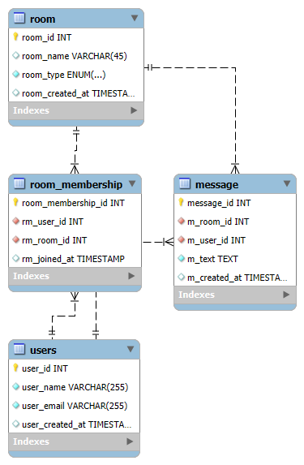

# QuickTalk

This is a real-time chat application built using WebSocket technology. The application allows users to chat in private and group rooms, with persistent messages stored in a MySQL database. The frontend is built with React, while the backend is developed using Spring Boot.

## Features

- **Real-Time Communication**: Supports private and group chat using WebSockets.
- **User Authentication**: Secure login and user management with Amazon Cognito.
- **Persistent Messaging**: Messages are saved in the MySQL database for future reference.
- **Interactive Frontend**: Responsive UI built with React.
- **API Documentation**: Comprehensive API documentation available via Swagger UI.

## Technology Stack

- **Frontend**: React
- **Backend**: Spring Boot
- **Database**: MySQL
- **WebSockets**: For real-time chat functionality
- **Swagger**: For API documentation

## Getting Started

### Prerequisites

- **Node.js**: For running the React frontend.
- **Java 8 or above**: For running the Spring Boot backend.
- **MySQL 8 or above**: For the database.
- **Maven 3.9 or above**: For managing Java dependencies.

### Setup

1. **Clone the repository**:
    ```bash
    git https://github.com/charley-v/quicktalk.git
    cd quicktalk
    ```

2. **Setup the MySQL Database**:
    - Navigate to the database directory:
      ```bash
      cd database
    - Run the schema provided in `schema.sql` to set up the database and tables

3. **Setup Amazon Cogntio User pool**
    - Create an AWS account and log in to the AWS Management Console and create a new User Pool
    - We will be using Cognito Hosted UI. Choose an application type ‘Single-page application (SPA) since ours is a React app
    - Configure attributes such as email for sign-in and email and name as required ones for sign-up. Configure password policies
    - Edit authentication flows for your app client and select ‘Sign in with username and password’
    - Define callback URLs for the React application (e.g., http://localhost:3000/callback for local testing)

4. **Configure the Backend**:
    - Navigate to the backend directory:
      ```bash
      cd backend
      ```
    - Configure `application.properties` file in `src/main/resources/application.properties` with MySQL credentials, frontend url, SSL certificate path, password & Cognito user pool JWKS keys 

5. **Run the Spring Boot Backend**:
    ```bash
    mvn clean install
    mvn spring-boot:run
    ```

6. **Configure the Frontend**:
    - Navigate to the frontend directory:
      ```bash
      cd ../frontend
      ```
    - Configure `Config.js` file in `src/Constants/Config.js` with Cognito domain, client Id and backend url
    
7. **Run the React app**:
    - Install dependencies and start the React app:
      ```bash
      npm install
      npm start
      ```

## Database Schema

The database schema is available in `database/schema.sql`. Below is the relational schema diagram:




## API Documentation

The backend APIs are documented using Swagger. You can access the Swagger UI by running the backend application and navigating to:

```bash
http://localhost:8080/swagger-ui.html
```

A screenshot of the Swagger UI is shown below:


Alternatively, you can view the [Swagger Documentation (PDF)](img/QuickTalk_API_Documentation.pdf) directly which provides a comprehensive overview of all backend API endpoints, including details on request and response formats, HTTP methods, parameters, and example payloads. It serves as a complete reference for developers to understand how to interact with the WebSocket-based chat application's backend.
